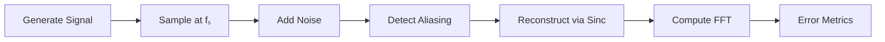
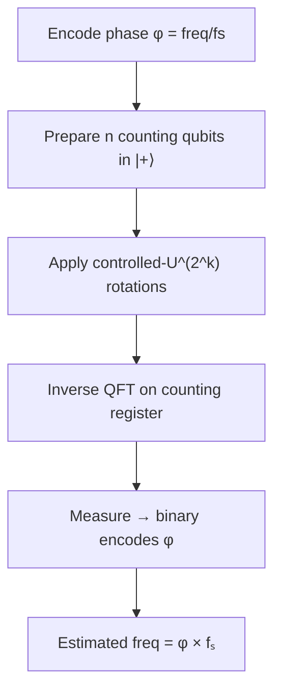
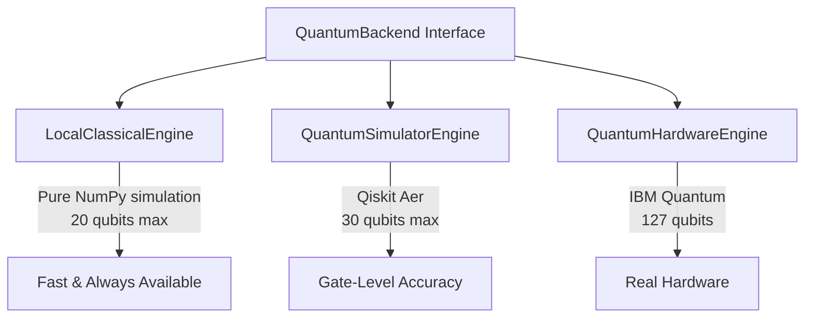
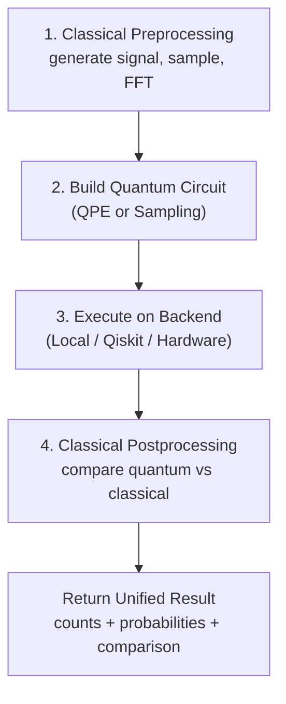
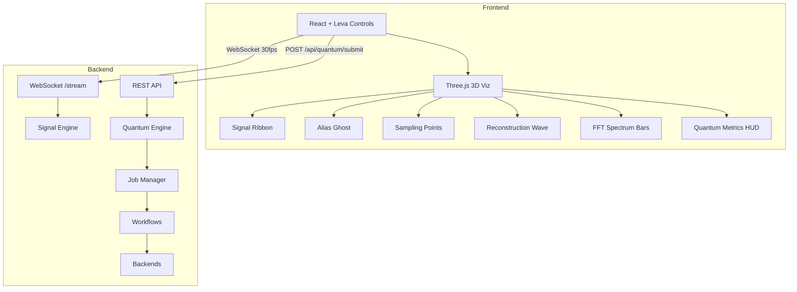

# AliasingViz 3D — Project Explanation

> **Quantum Sampling & Aliasing Visual Demonstrator**
> A hybrid classical-quantum application that visualizes the Nyquist-Shannon sampling theorem and lets you run real quantum circuits to analyze signals.

---

## 1. The Core Problem: Sampling & Aliasing

### What is Sampling?

In the real world, signals (sound, radio waves, sensor data) are **continuous** — they exist at every instant of time. But computers are **digital** — they can only store discrete snapshots. **Sampling** is the process of taking these snapshots at regular intervals.

```
Continuous Signal:   ~~~∿∿∿~~~∿∿∿~~~
                      ↓  ↓  ↓  ↓  ↓  ↓     ← take snapshots
Sampled (Digital):   •  •  •  •  •  •
```

The rate at which you take snapshots is called the **sampling rate (fₛ)**, measured in samples per second (Hz).

### What is Aliasing?

**Aliasing** is what happens when you don't sample fast enough. The digital version of the signal becomes a *completely different signal* — a fake, lower-frequency impostor (an "alias").

**Real-world analogy:** Think of a car wheel on video. If the camera captures frames too slowly, the wheel appears to spin *backward* — that's aliasing. The true rotation speed "aliases" into a false, lower speed.

### The Nyquist-Shannon Theorem

This fundamental theorem states:

> **To perfectly capture a signal of frequency `f`, you must sample at a rate fₛ ≥ 2f.**

The threshold `fₛ/2` is called the **Nyquist frequency**. If your signal frequency exceeds this limit → aliasing occurs.

| Signal Freq | Sampling Rate | Nyquist Limit | Aliased? | Alias Appears As |
|:-----------:|:------------:|:-------------:|:--------:|:---------------:|
| 100 Hz | 300 Hz | 150 Hz | ✅ No | 100 Hz (correct) |
| 200 Hz | 300 Hz | 150 Hz | ⚠️ Yes | 100 Hz (wrong!) |
| 400 Hz | 300 Hz | 150 Hz | ⚠️ Yes | 100 Hz (wrong!) |

The alias frequency is computed by "folding" the true frequency back into the `[0, fₛ/2]` range.

---

## 2. The Classical Signal Processing Pipeline

This is the backbone of the app. It runs in [signal_engine.py](file:///c:/Users/gsgmk/OneDrive/Desktop/Project/Quantum/backend/signal_engine.py) and executes a 7-step pipeline:



### Step-by-Step Breakdown

| Step | Function | What It Does |
|------|----------|-------------|
| 1 | [generate_signal()](file:///c:/Users/gsgmk/OneDrive/Desktop/Project/Quantum/backend/signal_engine.py#13-40) | Creates a continuous waveform (sine, square, sawtooth, triangle) at 10,000 points/sec |
| 2 | [sample_signal()](file:///c:/Users/gsgmk/OneDrive/Desktop/Project/Quantum/backend/signal_engine.py#44-64) | Picks regularly-spaced snapshots at rate `fₛ` |
| 3 | [add_noise()](file:///c:/Users/gsgmk/OneDrive/Desktop/Project/Quantum/backend/signal_engine.py#68-74) | Adds Gaussian noise to simulate real-world imperfections |
| 4 | [get_alias_frequency()](file:///c:/Users/gsgmk/OneDrive/Desktop/Project/Quantum/backend/signal_engine.py#78-97) | Checks if `f > fₛ/2` and computes the alias frequency |
| 5 | [reconstruct_signal()](file:///c:/Users/gsgmk/OneDrive/Desktop/Project/Quantum/backend/signal_engine.py#101-120) | Rebuilds the continuous signal from samples using **Whittaker-Shannon sinc interpolation** |
| 6 | [compute_fft()](file:///c:/Users/gsgmk/OneDrive/Desktop/Project/Quantum/backend/signal_engine.py#124-143) | Converts to frequency domain via Fast Fourier Transform |
| 7 | [compute_error()](file:///c:/Users/gsgmk/OneDrive/Desktop/Project/Quantum/backend/signal_engine.py#147-170) | Compares original vs reconstructed: MSE, SNR, Max Error |

### Sinc Interpolation (Reconstruction)

The reconstruction formula is the **Whittaker-Shannon interpolation**:

```
x(t) = Σₙ x[n] · sinc((t − nTₛ) / Tₛ)
```

Where `sinc(x) = sin(πx)/(πx)`. This is the *mathematically ideal* way to reconstruct a bandlimited signal from its samples — it proves the Nyquist theorem works both ways.

---

## 3. The Quantum Engine — Explained from Scratch

### Why Quantum Computing for Signal Processing?

Quantum computers are fundamentally built for two things this project exploits:

1. **Superposition** — A qubit can be `|0⟩` AND `|1⟩` simultaneously. With `n` qubits, you can represent `2ⁿ` states at once.
2. **Interference** — Quantum states can constructively/destructively interfere, amplifying correct answers and canceling wrong ones.

These properties make quantum computers natural at:
- **Fourier Transforms** (the QFT is exponentially faster than classical FFT)
- **Phase Estimation** (extracting hidden periodicities)
- **Probability Sampling** (encoding signal distributions natively)

### Qubits & Quantum States

A **qubit** is the quantum version of a classical bit:

| Classical Bit | Qubit |
|:---:|:---:|
| Either `0` or `1` | `α|0⟩ + β|1⟩` (both at once!) |
| Deterministic | Probabilistic: `|α|² + |β|² = 1` |
| Read → always same | Measure → collapses to `0` or `1` |

When you measure a qubit in state `α|0⟩ + β|1⟩`:
- Probability of getting `0` = `|α|²`
- Probability of getting `1` = `|β|²`

With **n qubits**, you get a superposition over all `2ⁿ` possible binary strings. That's exponential parallelism.

### Quantum Gates

Quantum gates manipulate qubits. Key gates used in this project:

| Gate | Symbol | Effect |
|------|--------|--------|
| **Hadamard (H)** | `H` | Creates equal superposition: `\|0⟩ → (|0⟩+|1⟩)/√2` |
| **Phase (P)** | `P(θ)` | Adds a phase: `\|1⟩ → e^(iθ)|1⟩` |
| **Controlled-Phase (CP)** | `CP(θ)` | Applies phase only if control qubit is `\|1⟩` |
| **SWAP** | `SWAP` | Exchanges two qubits |
| **X (NOT)** | `X` | Flips `\|0⟩ ↔ |1⟩` |

---

## 4. Quantum Circuits in This Project

The project implements three quantum circuit types in [circuits.py](file:///c:/Users/gsgmk/OneDrive/Desktop/Project/Quantum/backend/quantum_engine/circuits.py):

### 4.1 Quantum Phase Estimation (QPE)

**Purpose:** Extract the frequency of a signal by estimating the phase `φ = f/fₛ`.

**How it works:**



1. **Encode the phase:** The signal frequency `f` at sampling rate `fₛ` gives phase `φ = f/fₛ (mod 1)`
2. **Counting qubits:** `n` qubits in superposition via Hadamard gates
3. **Controlled rotations:** Each counting qubit applies `CP(2π · φ · 2^k)` to the target
4. **Inverse QFT:** Converts the phase information into a measurable binary string
5. **Measurement:** The most probable outcome `m` gives estimated phase `φ̂ = m/2ⁿ`

**The QPE probability formula** for measuring outcome `k`:

```
P(k) = |sin(Nπ(φ − k/N)) / (N · sin(π(φ − k/N)))|²
```

where `N = 2ⁿ`. This concentrates probability mass near `k ≈ φ · N`.

### 4.2 Quantum Sampling

**Purpose:** Encode a classical signal's amplitude distribution into a quantum state.

Signal sample values are loaded into qubit amplitudes via **amplitude encoding:**

```
|ψ⟩ = Σᵢ √(pᵢ) |i⟩
```

where `pᵢ` are the normalized signal amplitudes. Measuring this state generates samples from the signal's distribution — achieving quantum-native sampling.

### 4.3 Quantum Fourier Transform (QFT)

**Purpose:** The quantum analog of the classical FFT.

The QFT maps `n` qubits through Hadamard gates and controlled phase rotations to produce the Fourier transform of the input state. It runs in [O(n²)](file:///c:/Users/gsgmk/OneDrive/Desktop/Project/Quantum/backend/quantum_engine/models.py#98-109) gates vs the classical FFT's [O(n · 2ⁿ)](file:///c:/Users/gsgmk/OneDrive/Desktop/Project/Quantum/backend/quantum_engine/models.py#98-109) — an **exponential speedup**.

---

## 5. Noise Models — Real-World Quantum Imperfections

Real quantum hardware is noisy. The project simulates three noise regimes defined in [backends.py](file:///c:/Users/gsgmk/OneDrive/Desktop/Project/Quantum/backend/quantum_engine/backends.py):

| Model | How It Works | Effect |
|-------|--------------|--------|
| **Ideal** | No noise | Perfect results |
| **Depolarizing** | Each gate has a probability `p` of replacing the qubit with random noise | Output drifts toward uniform distribution; error compounds with circuit depth |
| **Thermal** | Simulates T1/T2 relaxation — qubits naturally decay toward `\|0⟩` over time | Lower-energy states become more probable; biases measurement results |

**Fidelity** estimates how close the noisy result is to the ideal one:

```
Fidelity = (1 − gate_error)^(depth × qubits) × (1 − measurement_error)^qubits
```

---

## 6. Execution Backends

Three backend engines with a common interface ([backends.py](file:///c:/Users/gsgmk/OneDrive/Desktop/Project/Quantum/backend/quantum_engine/backends.py)):



| Backend | Dependency | Qubits | Use Case |
|---------|-----------|--------|----------|
| [LocalClassicalEngine](file:///c:/Users/gsgmk/OneDrive/Desktop/Project/Quantum/backend/quantum_engine/backends.py#63-264) | NumPy only | ≤ 20 | Fast prototyping, always works |
| [QuantumSimulatorEngine](file:///c:/Users/gsgmk/OneDrive/Desktop/Project/Quantum/backend/quantum_engine/backends.py#269-413) | Qiskit + Aer | ≤ 30 | Realistic gate-level simulation |
| [QuantumHardwareEngine](file:///c:/Users/gsgmk/OneDrive/Desktop/Project/Quantum/backend/quantum_engine/backends.py#418-455) | IBM Quantum API | ≤ 127 | Real quantum hardware (placeholder) |

---

## 7. The Hybrid Workflow

The full pipeline in [workflows.py](file:///c:/Users/gsgmk/OneDrive/Desktop/Project/Quantum/backend/quantum_engine/workflows.py) merges classical and quantum:



**Comparison metrics computed:**
- **QPE:** Quantum-estimated frequency vs FFT peak frequency + frequency error in Hz
- **Sampling:** KL divergence between quantum measurement distribution and classical signal distribution

---

## 8. Architecture Overview



| Layer | Tech | Purpose |
|-------|------|---------|
| **Frontend** | React + Three.js + R3F | Interactive 3D signal visualization |
| **State** | Zustand | Reactive parameter management |
| **Transport** | WebSocket @ 30fps | Real-time classical signal streaming |
| **Backend** | FastAPI + Uvicorn | API server and WebSocket handler |
| **Signal Engine** | NumPy + SciPy | Classical DSP pipeline |
| **Quantum Engine** | Custom + Qiskit | Circuit construction, execution, comparison |
| **Jobs** | asyncio | Async quantum job lifecycle |
| **Persistence** | SQLite | Experiment history storage |
| **Automation** | n8n | AI-driven alias explanations |
| **Infrastructure** | Docker Compose | Multi-service deployment |

---

## 9. Key Takeaways

1. **The Nyquist theorem** is the foundation: sample at ≥ 2× the signal frequency, or you get aliasing.
2. **Quantum Phase Estimation** can extract frequency information by encoding `f/fₛ` as a quantum phase and using interference to amplify the correct answer.
3. **Quantum Sampling** encodes signal amplitudes directly into qubit states, enabling native probabilistic sampling.
4. **The QFT** is the quantum analog of FFT with an exponential speedup in gate count.
5. **Noise models** (depolarizing, thermal) simulate how real quantum hardware introduces errors that accumulate with circuit depth.
6. **The hybrid workflow** leverages classical preprocessing → quantum execution → classical postprocessing, comparing both approaches side-by-side.
